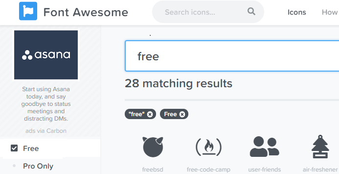

※作成中※
---
### マークダウンで簡単にスライドが作れるサービス『GitPitch』
### （Advance）
　  

　  
　  
　　　　id:kakisoft
---
### 自己紹介  
　  
**名前**：垣花　暁（かきのはな　さとる）    
　  
**出身**：沖縄県  
　  
**仕事**：物流系エンジニア（フリーランス）  
.NET/Java/Oracleがメイン。  
物流業界向けの言語や機器が使えます。  
　  
**趣味**：リアル脱出ゲーム
---
このスライドは、**「GitPitch」**という、  
GitHubアカウントがあれば、マークダウンで  
スライドが作成できるサービスを利用しています。
---
よく使っているのですが、  
何か色々と機能が増えているので、  
もう少し使ってみました。
---
基本的な使い方は、[https://gitpitch.com/kakisoft/HowToUseGitPitch](こちらのスライド)  
にて紹介しています。
　  
初めて使う方は、上記のスライドを先に、  
ご参照頂けたらと思います。
---
追加機能
---
## テーマ


---
### フォントサイズ
---
@size[2.5em](こんな感じ)に、  
フォントのサイズを  
自由に変更できるようになりました。
---
書き方は、**『@size\[2.5em\](こんな感じ)』** です。
　  
　  
@size[1.1em](「@size」を記述し、\[フォントサイズ\] (文字))  
と、記述します。
---
### フォントカラー
---
@size[2.0em](@color[blue](こんな感じ))に、  

フォントカラーを @color[#DC143C](自由に設定できる)  
ようになりました。
---
書き方は、**『@color\[blue\](こんな感じ)』** です。
　  
　  
@size[1.1em](「@color」を記述し、\[色\] (文字))  
と、記述します。
---
### カスタムCSS
---
PITCHME.yaml（設定ファイル）にて、  
以下のように、カスタム CSSが設定できます。
```
theme-override : assets/css/PITCHME.css
```

---
例えば、以下のような css を記述し、
```css
.headline {
  color: blue;
  font-size: 1.1em;
}
```
こんな感じに @css[headline](使う事が出来ます。)
---
書き方は、**『@css\[クラス\](内容)』** です。
　  
　  
@size[1.1em](「@css」を記述し、\[クラス\] (文字))  
と、記述します。
---
### アイコン
---
@fa[check-square icon-size1](こんな風に)  
　  
@fa[twitter icon-size2](色々なアイコンが)  
　  
@fa[github icon-size3](使えるようになっています)  
---
書き方は、**『@fa\[アイコン名 サイズ\](テキスト)』**   
です。
　  
サイズと文字は省略可能です。  
また、CSSを適用する事もできます。
---
アイコンギャラリーは [こちら](https://fontawesome.com/icons?from=io)です。
　  
  

無料枠から探す場合、「Free」にチェックを  
入れておくといいかと思います。
---


---
### 引用
---
@quote[こんな感じで、引用符を<br>記述できます。]
---
書き方は、**『@quote\[こんな感じ\]』** です。
---


---
### フォントカラー
---
@size[2.0em](@quote[こんな感じで])に、  

フォントカラーを @color[#DC143C](自由に設定できる)  
ようになりました。
---
書き方は、**『@color\[blue\](こんな感じ)』** です。
　  
　  
@size[1.1em](「@color」を記述し、\[色\] (文字))  
と、記述します。
---


---
たいとる
---
@title[Some custom label]

## Your slide contents goes here.
---
x
---

## Tips!

<br>

@fa[arrows gp-tip](Press F to go Fullscreen)

@fa[microphone gp-tip](Press S for Speaker Notes)

---

## Template Features

- Code Presenting |
- Repo Source, Static Blocks, GIST |
- Custom CSS Styling |
- Slideshow Background Image |
- Slide-specific Background Images |
- Custom Logo, TOC, and Footnotes |

---?code=sample/go/server.go&lang=golang&title=Golang File

@[1,3-6](Present code found within any repo source file.)
@[8-18](Without ever leaving your slideshow.)
@[19-28](Using GitPitch code-presenting with (optional) annotations.)

---

@title[JavaScript Block]

<p><span class="slide-title">JavaScript Block</span></p>

```javascript
// Include http module.
var http = require("http");

// Create the server. Function passed as parameter
// is called on every request made.
http.createServer(function (request, response) {
  // Attach listener on end event.  This event is
  // called when client sent, awaiting response.
  request.on("end", function () {
    // Write headers to the response.
    // HTTP 200 status, Content-Type text/plain.
    response.writeHead(200, {
      'Content-Type': 'text/plain'
    });
    // Send data and end response.
    response.end('Hello HTTP!');
  });

// Listen on the 8080 port.
}).listen(8080);
```

@[1,2](You can present code inlined within your slide markdown too.)
@[9-17](Displayed using code-syntax highlighting just like your IDE.)
@[19-20](Again, all of this without ever leaving your slideshow.)

---?gist=onetapbeyond/494e0fecaf0d6a2aa2acadfb8eb9d6e8&lang=scala&title=Scala GIST

@[23](You can even present code found within any GitHub GIST.)
@[41-53](GIST source code is beautifully rendered on any slide.)
@[57-62](And code-presenting works seamlessly for GIST too, both online and offline.)

---

## Template Help

- [Code Presenting](https://github.com/gitpitch/gitpitch/wiki/Code-Presenting)
  + [Repo Source](https://github.com/gitpitch/gitpitch/wiki/Code-Delimiter-Slides), [Static Blocks](https://github.com/gitpitch/gitpitch/wiki/Code-Slides), [GIST](https://github.com/gitpitch/gitpitch/wiki/GIST-Slides) 
- [Custom CSS Styling](https://github.com/gitpitch/gitpitch/wiki/Slideshow-Custom-CSS)
- [Slideshow Background Image](https://github.com/gitpitch/gitpitch/wiki/Background-Setting)
- [Slide-specific Background Images](https://github.com/gitpitch/gitpitch/wiki/Image-Slides#background)
- [Custom Logo](https://github.com/gitpitch/gitpitch/wiki/Logo-Setting), [TOC](https://github.com/gitpitch/gitpitch/wiki/Table-of-Contents), and [Footnotes](https://github.com/gitpitch/gitpitch/wiki/Footnote-Setting)

---

## Go GitPitch Pro!

<br>
<div class="left">
    <i class="fa fa-user-secret fa-5x" aria-hidden="true"> </i><br>
    <a href="https://gitpitch.com/pro-features" class="pro-link">
    More details here.</a>
</div>
<div class="right">
    <ul>
        <li>Private Repos</li>
        <li>Private URLs</li>
        <li>Password-Protection</li>
        <li>Image Opacity</li>
        <li>SVG Image Support</li>
    </ul>
</div>

---

### Questions?

<br>

@fa[twitter gp-contact](@gitpitch)

@fa[github gp-contact](gitpitch)

@fa[medium gp-contact](@gitpitch)

---?image=assets/image/gitpitch-audience.jpg

@title[Download this Template!]

### <span class="white">Get your presentation started!</span>
### [Download this template @fa[external-link gp-download]](https://gitpitch.com/template/download/aqua)

